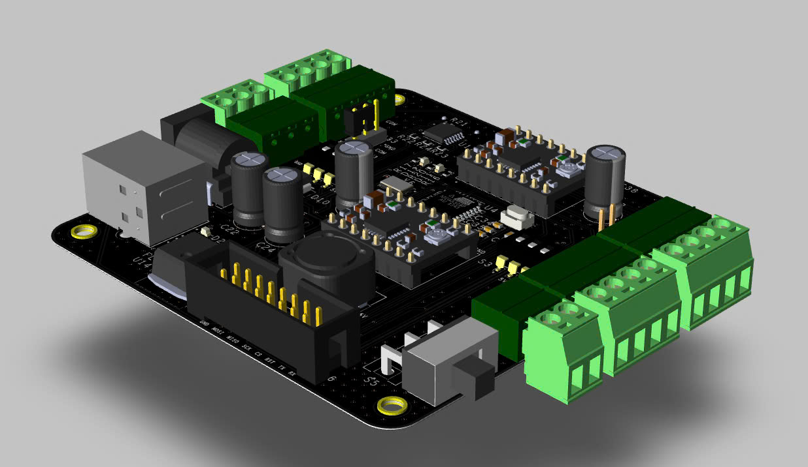
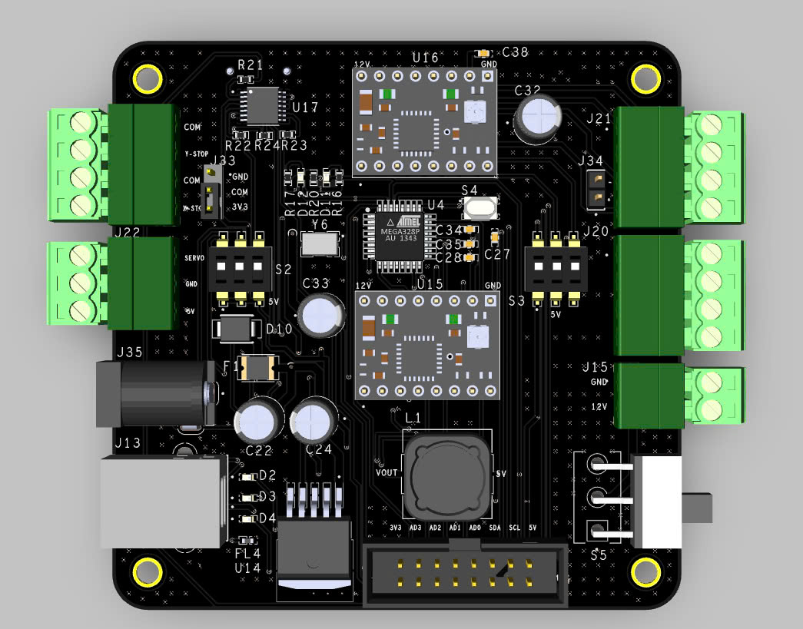
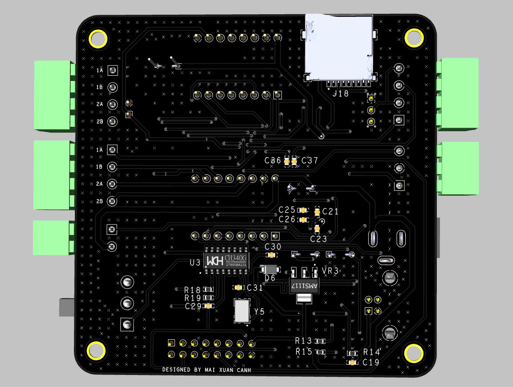
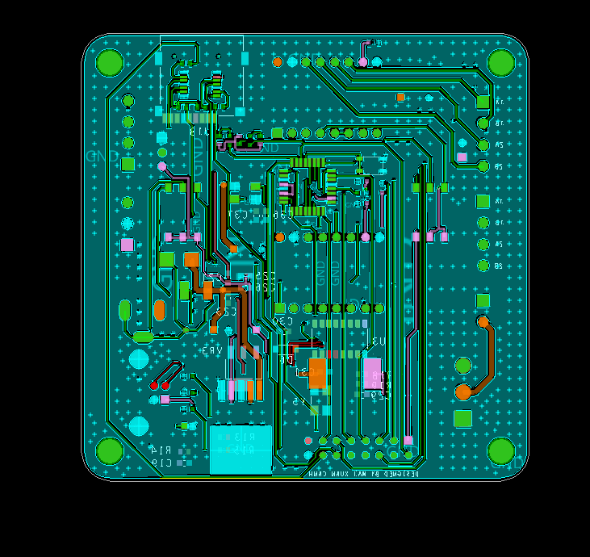
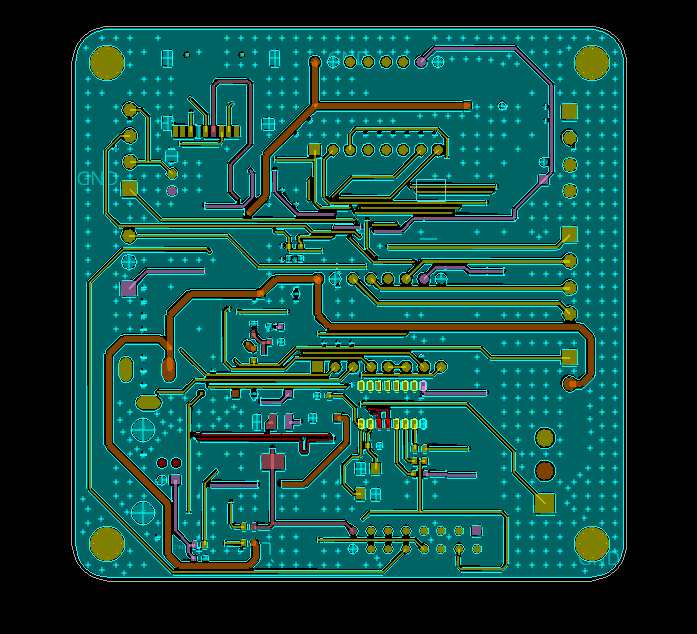
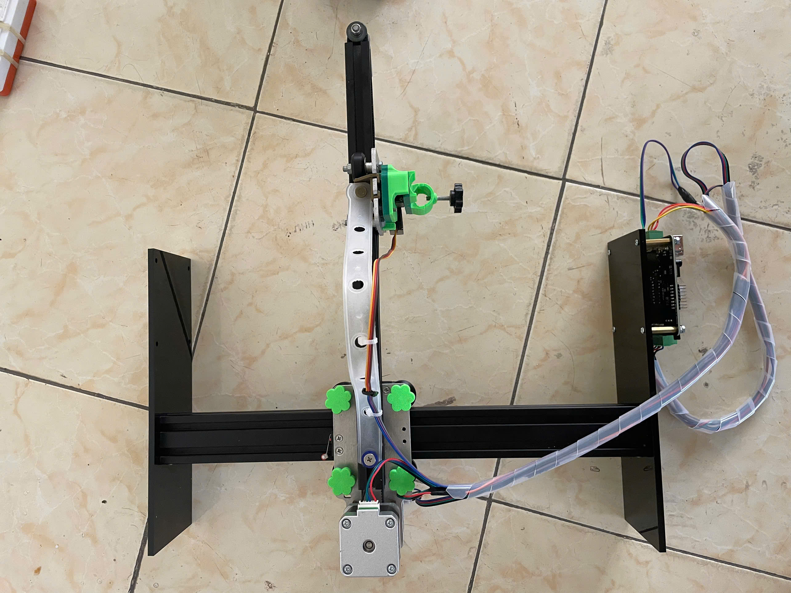
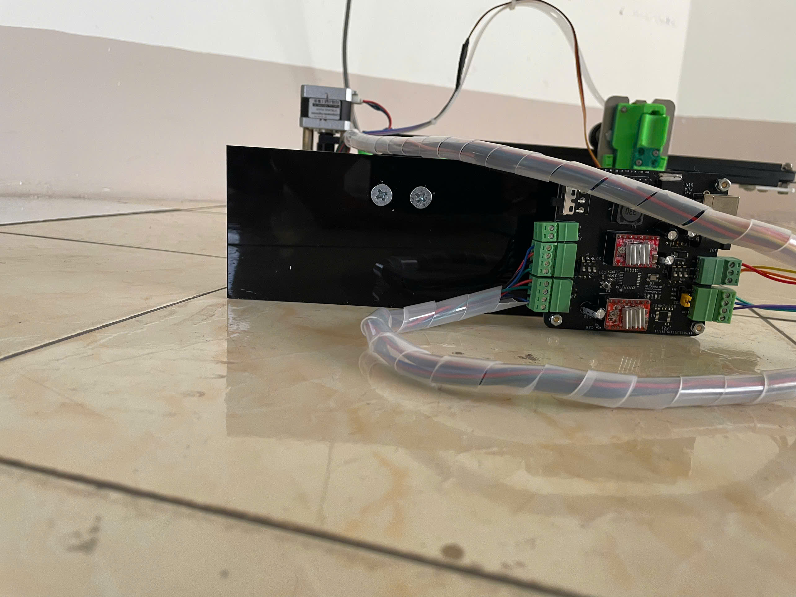
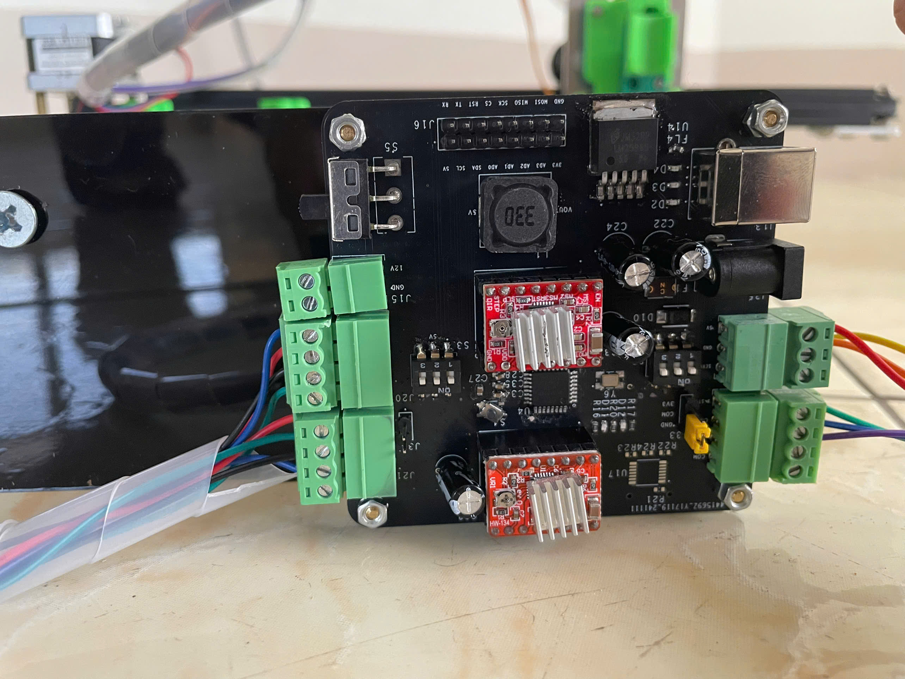
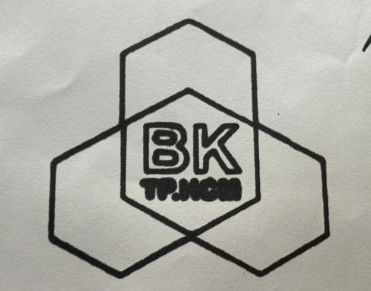

# CNC Machine Develop Board

This project, developed by **Huynh Van Thong**, involves creating a CNC Machine control board using OrCAD/Allegro v17.4 for educational and research purposes at Ho Chi Minh City University of Technology.

## Introduction

The CNC Machine Develop Board project provides documentation and guidance for developing a control board for CNC machines. The board is designed with advanced features, making it suitable for use in compact CNC control systems.

## Product Images

Here are images of the board from different perspectives:

| View         | Image                                                  |
|--------------|--------------------------------------------------------|
| **FrontLeft**|    |
| **TOP**      |                 |
| **BOTTOM**   |           |
| **Layout TOP**      |                 |
| **Layout BOTTOM**   |           |
| **Machine TOP**   |           |
| **Machine RIGHT**   |           |
| **PCB**   |           |
| **Result**   |           |

---

